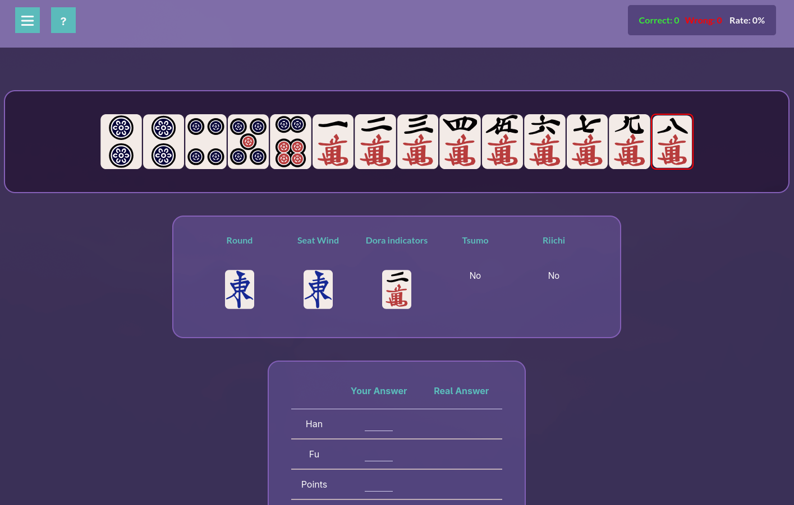

# Riichi Mahjong Score Trainer

A web application to help people practice scoring in Riichi Mahjong. All winning hands are taken from Tenhou logs using the python scripts in [https://github.com/Varantha/Mahjong-LogParser](https://github.com/Varantha/Mahjong-LogParser)

## Site URL

https://scoringtrainer.konbamwa.net/

## Translations

This site supports multiple languages! Currently available:
- English
- Japanese (日本語)
- Korean (한국어)

Want to help translate the site into another language? Check out the [Translation Guide](TRANSLATION_GUIDE.md) for detailed instructions on how to contribute translations.

## Contributions

Contributions are welcome! Feel free to open an issue or submit a pull request if you'd like to improve the project or suggest new features.

## Thanks to

Work was inspired / made possible by the following people:

